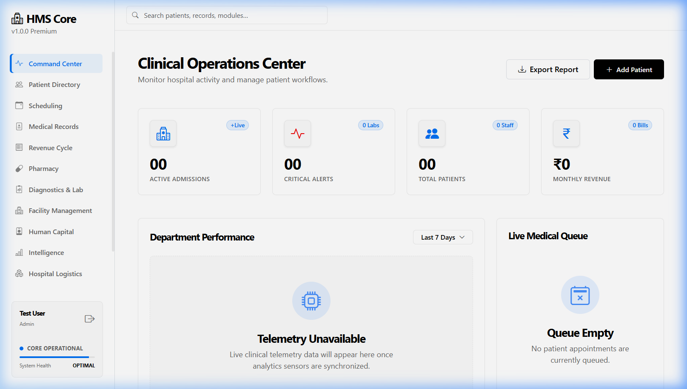
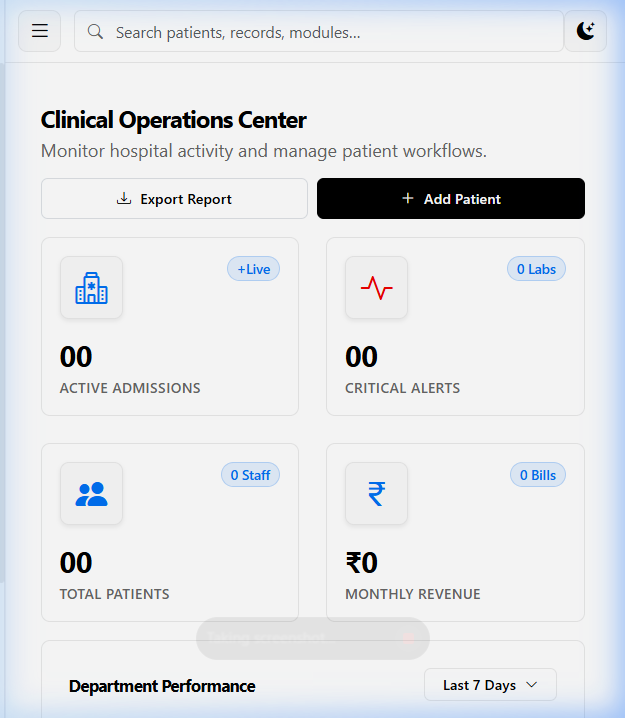
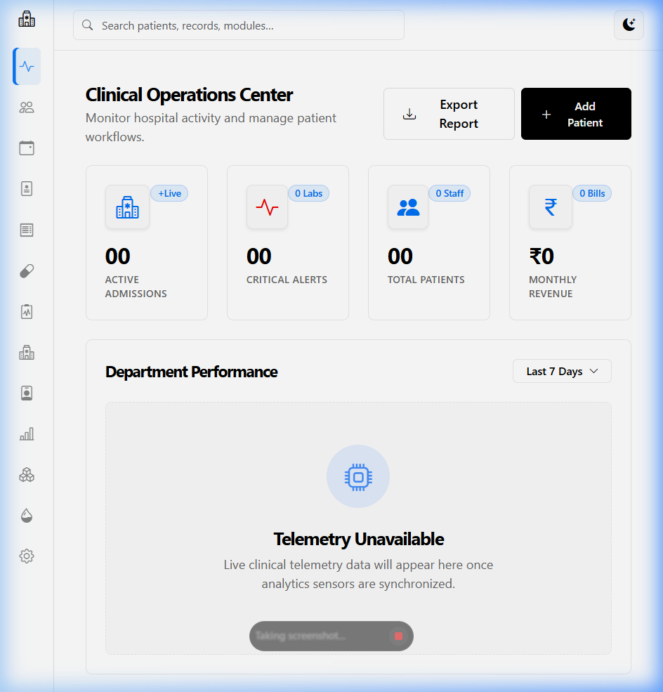

# HMS Elite: Technical Documentation & Clinical Manual

## A Comprehensive Guide to the Elite Hospital Management System

---

## 1. Project Vision & Executive Summary

The **HMS Elite (Hospital Management System)** is a state-of-the-art, production-grade platform designed to revolutionize healthcare administration. By digitizing the patient lifecycle and clinical workflows, HMS Elite provides a unified ecosystem where administrative efficiency meets clinical excellence.

Built on a modern, asynchronous architecture, the system supports 13 specialized modules, ensuring that from the moment a patient registers to the final billing process, every data point is secure, persistent, and actionable.

---

## 2. Technology Stack & Modern Architecture

HMS Elite leverages a high-performance stack to ensure scalability, responsiveness, and security.

### Core Stack Components
| Layer | Technology | Purpose |
| :--- | :--- | :--- |
| **Frontend** | React 19, Vite 7 | Modern, component-based SPA architecture |
| **Backend** | FastAPI (Python 3.12+) | Async high-performance RESTful API |
| **Data Layer** | PostgreSQL / SQLite | Robust relational storage with SQLAlchemy ORM |
| **Security** | JWT (HS256) | Encrypted session management and authentication |
| **DevOps** | Docker, Gunicorn, Uvicorn | Production-ready process management |

### System Architecture Layers
-   **Client Tier (React SPA)**: Manages local state and delivers a responsive UX across desktop and mobile devices.
-   **API Tier (FastAPI)**: Enforces business logic, performs JWT validation, and ensures data isolation via unique ownership IDs.
-   **Persistence Tier (Alembic/SQLAlchemy)**: Manages database schema migrations and complex relational queries.

---

## 3. Comprehensive Security Framework

Security is the foundation of HMS Elite, protecting sensitive medical data through multi-layered defense.

| Dimension | Implementation Strategy |
| :--- | :--- |
| **Authentication** | OAuth2 with JWT Bearer tokens, issued upon secure login. |
| **Authorization** | Row-level data isolation; records are strictly scoped to the authenticated user. |
| **Data Integrity** | PBKDF2-HMAC-SHA256 salted hashing for all sensitive credentials. |
| **Traffic Safety** | Rate limiting (SlowAPI) and secure headers (HSTS, CSP, X-Frame-Options). |
| **Session Control** | Configurable token expiry (default 24 hours) for clinical session safety. |

---

## 4. The Clinical Module Ecosystem

HMS Elite provides specialized interfaces for every department within a medical facility.

-   **Clinical Operations Center**: A real-time heart of the facility, monitoring admissions, critical alerts, and revenue.
-   **Patient Registry**: A comprehensive database for registration, status tracking (Inpatient/Outpatient), and history.
-   **Appointment Scheduling**: Conflict-aware scheduling to optimize clinician time and patient flow.
-   **Electronic Medical Records (EMR)**: Persistent storage for diagnoses, prescriptions, and clinical findings.
-   **Laboratory & Diagnostics**: Management of test orders, diagnostic classification, and results tracking.
-   **Pharmacy & Inventory**: Integrated stock management with automated alerts for low inventory and expiration tracking.
-   **Bed Management**: Real-time monitoring of ward occupancy (ICU, General Ward) and admissions.
-   **Human Resources**: Centralized onboarding and shift management for medical and administrative staff.
-   **Blood Bank Repository**: Tracking of blood inventory by group, status, and donation trends.
-   **Finance & Billing**: Automated invoice generation linked directly to clinical services and pharmacy orders.

---

## 5. Interconnectivity & Data Orchestration

The power of HMS Elite lies in how its modules interact to create a 360-degree view of operations.

-   **Patient ID Linkage**: The Patient ID acts as the "Golden Key," linking clinical records, billing sessions, and laboratory orders.
-   **Clinical Attribution**: Staff (Doctors/Nurses) are dynamically linked to EMR entries and appointments for accountability.
-   **Financial Telemetry**: Revenue data from Billing modules flows instantly into the Dashboards for executive oversight.
-   **Operational Alerts**: Supply levels from Pharmacy and Inventory trigger notifications within the Reports and Analytics module.

---

## 6. Installation & Ecosystem Setup

To deploy HMS Elite in a local development or production environment, follow these standardized procedures.

### Backend Initialization
```bash
# Environment Setup
python -m venv .venv
source .venv/bin/activate

# Dependency Management
pip install -r backend/requirements.txt

# Database Migration
alembic upgrade head

# Execution
uvicorn backend.app.main:app --host 127.0.0.1 --port 8000
```

### Frontend Initialization
```bash
# Dependency Management
npm install

# Dev Server Execution
npm run dev
```

---

## 7. Integrated User Workflow

1.  **Secure Access**: Staff authenticate via the secure login portal.
2.  **Intake**: Front-desk staff registry a patient, automatically assigning a unique Clinical ID.
3.  **Consultation**: Clinicians schedule and execute appointments, updating the EMR in real-time.
4.  **Service Fulfillment**: Laboratory tests are ordered, and pharmacy prescriptions are fulfilled within their respective modules.
5.  **Revenue Cycle**: Upon service completion, the system aggregates all data points to generate an accurate, detailed invoice.
6.  **Executive Oversight**: Management reviews real-time dashboard analytics to optimize facility performance.

---

## 8. Engineering Excellence: Challenges & Solutions

| Challenge | Engineering Solution |
| :--- | :--- |
| **SPA Deep Linking** | Implemented a custom 404 fallback handler in FastAPI to serve the React index for non-API routes. |
| **Schema Evolution** | Integrated Alembic for versioned database migrations, ensuring consistency across environments. |
| **Production Resilience** | Utilized Gunicorn with Uvicorn workers for asynchronous request handling and process stability. |
| **Data Privacy** | Enforced strict ownership validation on every API endpoint to prevent cross-account access. |

---

## 9. System Interface & Responsiveness

HMS Elite is built with a **Mobile-First Responsive Architecture**. The interface adapts seamlessly to diverse screen sizes used by clinical staff on the move.

### 🖥️ Desktop Perspective
The full-screen dashboard provides expansive data visualization and department performance telemetry.


### 📱 Mobile & Tablet Perspective
The system reorganizes metrics into a vertical stack on mobile devices while maintaining full functionality via an optimized navigation menu.
| Mobile Interface | Tablet Interface |
| :--- | :--- |
|  |  |

---

## 10. Strategic Roadmap & Future Improvements

-   **Telemedicine Hub**: Native video consultation for remote diagnostics.
-   **RBAC Enhancement**: Granular permission tiers for nursing, clinical, and administrative roles.
-   **Mobile Native App**: Dedicated iOS and Android implementations using React Native.
-   **AI Diagnostics**: Predictive analytics to identify patient admission trends and equipment maintenance.

---

*HMS Elite Documentation v1.1.0 — A Fusion of Technical Specification and Clinical Utility.*
