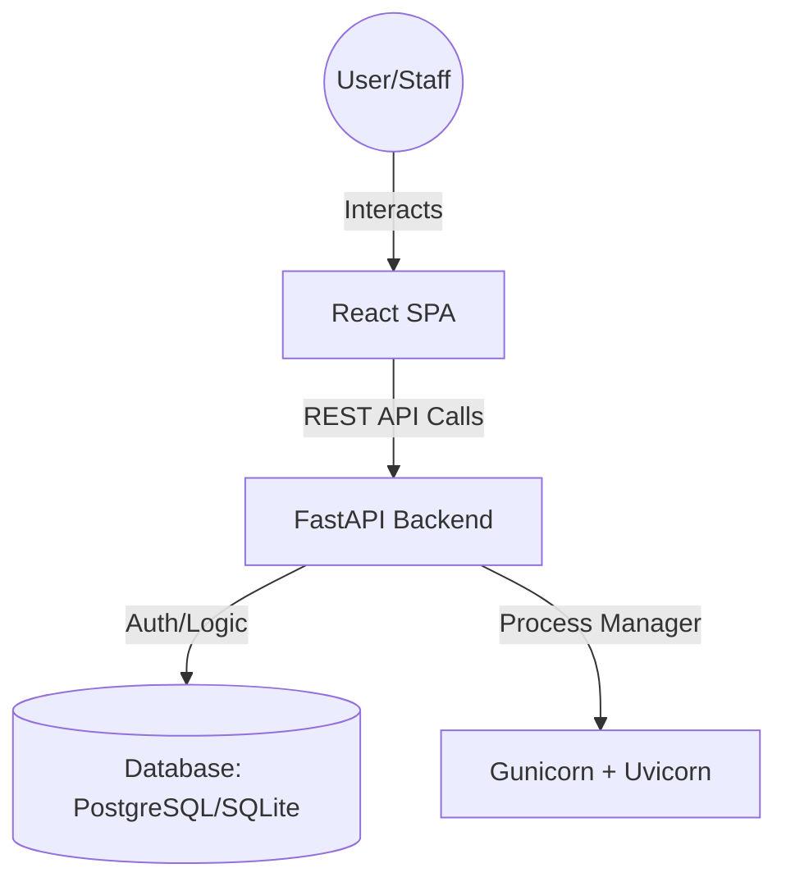

# Hospital Management System (HMS) Documentation

A professional, comprehensive, and scalable Hospital Management System built with a modern tech stack. This application streamlines clinical operations, patient management, and administrative workflows for healthcare providers.

---

## 1. Project Overview

### Purpose
The **Hospital Management System (HMS)** is a full-stack web application designed to digitize and automate the day-to-day operations of a medical facility. From patient registration to billing and pharmacy management, the system provides a centralized platform for clinicians and administrative staff to deliver efficient healthcare.

### Core Features
- **Patient Management**: Complete lifecycle tracking, from registration to discharge.
- **Clinical Operations**: Appointment scheduling, Electronic Medical Records (EMR), and Lab Test tracking.
- **Resource Management**: Staff scheduling, Bed occupancy tracking, and Inventory (Medicine/Equipment).
- **Financials**: Automated billing, invoicing, and revenue dashboards.
- **Data Analytics**: Live clinical telemetry and operational reporting.

### Target Users
- **Administrators**: Manage staff, facilities, and financial reports.
- **Doctors/Clinicians**: Access patient records, manage appointments, and prescribe medications.
- **Pharmacists**: Manage inventory and fulfill prescriptions.
- **Front-Desk Staff**: Register patients and schedule consultations.

---

## 2. Tech Stack

### Frontend
- **Framework**: [React](https://react.dev/) + [Vite](https://vitejs.dev/)
- **Styling**: Vanilla CSS with [Tailwind CSS](https://tailwindcss.com/) (where applicable) and Bootstrap Icons.
- **State Management**: React Context API
- **Networking**: Axios / Fetch API
- **Reporting**: [jsPDF](https://github.com/parallax/jsPDF) and [jsPDF-AutoTable](https://github.com/simonbengtsson/jsPDF-autotable) for PDF generation.

### Backend
- **Framework**: [FastAPI](https://fastapi.tiangolo.com/) (Python)
- **Authentication**: JWT (JSON Web Tokens) with OAuth2 Password Bearer flow.
- **Database**: 
  - **Local**: SQLite (for rapid development/testing).
  - **Production**: PostgreSQL.
- **Security**: [SlowAPI](https://github.com/laurentS/slowapi) for rate limiting, `secure` for security headers.
- **Migrations**: [Alembic](https://alembic.sqlalchemy.org/en/latest/).

### DevOps & Infrastructure
- **Containerization**: [Docker](https://www.docker.com/) & Docker Compose.
- **Process Manager**: Gunicorn with Uvicorn workers.
- **Deployment**: Configured for [Render](https://render.com/) via `render.yaml`.

---

## 3. Architecture

The system follows a classic **Microservices-lite** / **Client-Server** architecture:

1.  **Client Tier**: A Single Page Application (SPA) built with React that communicates with the backend via a RESTful API.
2.  **Logic Tier**: A FastAPI backend that handles authentication, business logic, and database interactions.
3.  **Data Tier**: A relational database (PostgreSQL/SQLite) that persists all clinical and administrative data.



---

## 4. Installation & Setup

### Prerequisites
- Python 3.9+
- Node.js 18+
- Docker (Optional, for containerized run)

### Local Development Setup

#### 1. Backend Setup
```bash
# Navigate to the root directory
cd hms

# Create a virtual environment
python -m venv .venv
source .venv/bin/activate  # Windows: .venv\Scripts\activate

# Install dependencies
pip install -r backend/requirements.txt

# Run migrations
alembic upgrade head

# Start the server
uvicorn backend.app.main:app --reload --port 8000
```

#### 2. Frontend Setup
```bash
# In the root directory
npm install

# Start the Vite dev server
npm run dev
```
The application will be accessible at `http://localhost:5173`.

### Environment Variables
Create a `.env` file in the `backend/` directory:
```env
ENV=development
HMS_SECRET_KEY=your_secure_random_string
DATABASE_URL=sqlite:///./hms.db  # Or your Postgres URL
ALLOWED_ORIGINS=http://localhost:5173
```

---

## 5. API Endpoints (Major Routes)

All API routes are prefixed with `/api`.

| Feature | Method | Endpoint | Description |
| :--- | :--- | :--- | :--- |
| **Auth** | POST | `/api/auth/login` | Authenticate user and return JWT. |
| **Auth** | POST | `/api/auth/signup` | Register a new staff member. |
| **Patients** | GET | `/api/patients` | Retrieve a list of all patients. |
| **Patients** | POST | `/api/patients` | Register a new patient. |
| **Appointments** | GET | `/api/appointments` | List all scheduled appointments. |
| **Billing** | POST | `/api/invoices` | Generate a new invoice for a patient. |
| **Dashboard** | GET | `/api/dashboard/stats` | Fetch real-time clinical metrics. |

*Full documentation is available via Swagger at: `http://localhost:8000/docs`*

---

## 6. Folder Structure

```text
HMS/
├── backend/            # FastAPI Source Code
│   ├── app/            # Main application logic
│   │   ├── routers/    # API Route definitions
│   │   ├── models.py   # SQLAlchemy database models
│   │   ├── schemas/    # Pydantic validation schemas
│   │   └── main.py     # Entry point
│   ├── migrations/     # Alembic database migrations
│   └── tests/          # Pytest suite
├── dist/               # Built frontend assets (Production)
├── src/                # React Source Code
│   ├── components/     # Reusable UI components
│   ├── pages/          # Page-level components (Dashboard, Patients, etc.)
│   ├── lib/            # API clients and utilities
│   └── context/        # React Context (Auth, Theme, etc.)
├── Dockerfile          # Production Docker build
└── docker-compose.yml  # Multi-container orchestration
```

---

## 7. Detailed Feature Explanation

### 🏥 Clinical Operations Center (Dashboard)
The dashboard provides a high-level overview of the hospital's status. It features:
- **Real-time Stats**: Active admissions, critical alerts, and total patient count.
- **Financial Monitoring**: Monthly revenue tracking with currency formatting.
- **Live Queue**: A list of upcoming appointments for the day.
- **PDF Export**: Generate professional operational reports for management reviews.

### 📁 Electronic Medical Records (EMR)
Centralized storage for all patient medical history.
- **History Tracking**: Log every visit, diagnosis, and treatment.
- **Encrypted Privacy**: Secure handling of sensitive patient data.
- **Search & Filter**: Quick access to records via name or ID.

### 🧪 Laboratory & Pharmacy
Integrated module for diagnostic tests and medication.
- **Test Management**: Create and track laboratory test requests and results.
- **Inventory System**: Real-time tracking of medicine stock levels with alerts for low inventory.

### 📅 Appointment Scheduling
A robust system for managing clinician time.
- **Conflict Prevention**: Ensures no double-booking for doctors.
- **Status Tracking**: Monitor if a patient is 'Waiting', 'In Progress', or 'Completed'.

---

## 8. User Flow

1.  **Authentication**: Staff members log in using their credentials. The system issues a JWT for session management.
2.  **Patient Intake**: The front desk registers a new patient or finds an existing one in the system.
3.  **Scheduling**: An appointment is created for a specific doctor and time slot.
4.  **Consultation**: The doctor views the patient's EMR, conducts the consultation, and updates the medical record.
5.  **Labs & Pharmacy**: If required, the doctor orders lab tests or prescribes medication. The lab technician and pharmacist fulfill these requests through their respective interfaces.
6.  **Billing**: The system automatically aggregates charges (consultation, tests, medicines) and generates an invoice.
7.  **Analytics**: Administrators review the end-of-day reports to monitor facility efficiency and revenue.

---

## 9. System Screenshots & Responsiveness

The HMS is designed with a **Mobile-First Responsive Architecture**. The interface automatically adapts to different screen sizes, ensuring that clinicians can access critical data on the go.

### 🖥️ Desktop View (Dashboard)
The full dashboard provides an expansive view of clinical operations, including real-time charts and a sidebar for navigation.


### 📱 Mobile & Tablet Adaptability
On smaller screens, the system uses a collapsible sidebar and stacks operational metrics for better readability.
| Mobile View | Tablet View |
| :--- | :--- |
|  |  |

---

## 10. Challenges & Solutions

| Challenge | Solution |
| :--- | :--- |
| **SPA Route Handling** | Implemented a custom 404 handler in FastAPI to serve the React `index.html` for any non-API routes, allowing client-side routing to function seamlessly. |
| **Database Consistency** | Integrated **Alembic** to manage database schema migrations, ensuring that local SQLite and production PostgreSQL stayed in sync. |
| **Production Security** | Configured **Secure Headers** (HSTS, CSP, X-Frame-Options) and **Rate Limiting** to protect against common web vulnerabilities and brute-force attacks. |
| **Environment Parity** | Used `pydantic-settings` to manage configuration via `.env` files, making it easy to toggle between development and production modes. |

---

## 11. Future Improvements

- **Telemedicine Integration**: Video consultation capabilities for remote patient care.
- **Role-Based Access Control (RBAC)**: Granular permissions for different staff tiers (Nursing vs. Admin).
- **Mobile Application**: A dedicated Flutter/React Native app for patients to view their records and book appointments.
- **AI Analytics**: Predictive modeling to anticipate bed shortages or peak admission times.
- **Multi-Hospital Support**: Single dashboard to manage a chain of clinics/hospitals.

---

*Generated by Antigravity AI — Professional Software Engineering Documentation.*
